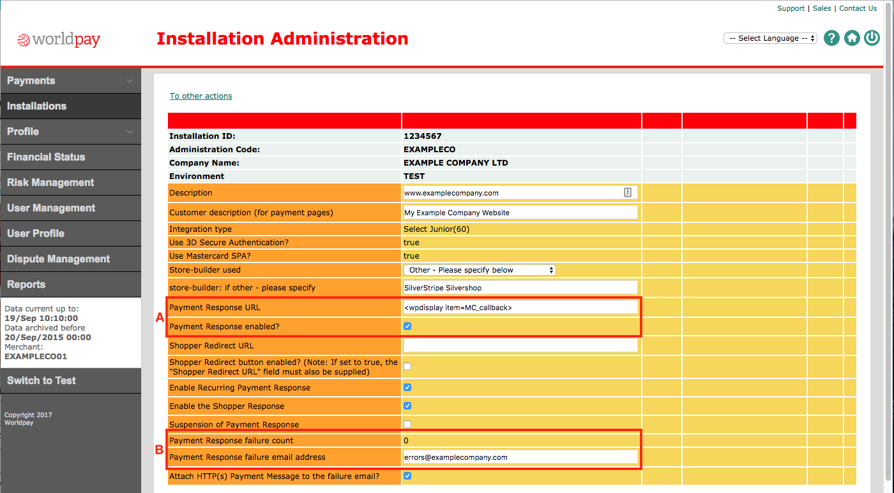

# Setting Up WorldPay payments

In order to start taking payments with WorldPay you will need to
create an account with [Worldpay](http://www.worldpay.com/).

next you will need to install the Omnipay WorldPay libraries
(ideally via composer):

    # composer require "omnipay/worldpay:^2.0"

## Setup WorldPay on your install

Once you have the WorldPay module installed, add the following
to `mysite/_config/payment.yml`

````
---
Name: payment
---
SilverStripe\Omnipay\Model\Payment:
  allowed_gateways:
    - 'WorldPay'

SilverStripe\Omnipay\GatewayInfo:
  WorldPay:
    parameters:
      installationId: '1010618'
      callbackPassword: 'xyz'
---
Except:
  environment: 'live'
---
SilverStripe\Omnipay\GatewayInfo:
  WorldPay:
    parameters:
      testMode: true
---
Only:
  environment: 'live'
---
SilverStripe\Omnipay\GatewayInfo:
  WorldPay:
    parameters:
      callbackPassword: 'abc'
````

The `installationId` will be provided by WorldPay when your account is
setup or can be retrieved from the "Installations" screen of the [WorldPay Admin](https://secure.worldpay.com/sso/public/auth/login.html).

The `callbackPassword` can be set in the WorldPay admin > Installations > Installation Adminiatration (using the 'Payment Response password' field).
**Note** You can add different passwords for test and live environments.

Additional supported settings can be found at the [omnipay-worldpay github page](https://github.com/thephpleague/omnipay-worldpay/blob/master/src/Gateway.php#L21).

## Setup WorldPay merchant account

In order for WorldPay to pass information about the payment back to your website, you must configure the WorldPay 'Payment Response' settings for this installation as per [WorldPay's documentation](http://support.worldpay.com/support/kb/bg/paymentresponse/pr0000.html).



As you can see from the highlighted area 'A', 'Payment Response' must be enabled and the callback URL must use the WorldPay 'WPDISPLAY ITEM tag' as detailed in the 'Dynamic payment response' section of the documentation referenced above.

Note that you can also see a tally of failed callback attempts in this interface and are able to specify an e-mail address for notifications of failed attempts, as can be seen in highlighted area 'B'.

## Using a custom callback response

If you want a custom callback response (so the user sees a styled page at
the end of the payment process and is returned back to your site) you
will need to enable the `WorldPayResponseExtension`.

You can add the following to your `config.yml` to achieve this:

````
SilverStripe\Omnipay\Service\PaymentService:
  extensions:
    - WorldPayResponseExtension
````

If you want to customise the apperance of the response page, just copy
the `WorldPayCallback.ss` template from this module and add it to your
`templates` folder.
